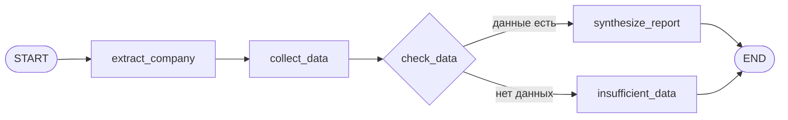

# Market Researcher — описание системы и ТЗ

## Что это за система

**Market Researcher** — сервис AI-аналитики публичных компаний. Пользователь отправляет текстовый запрос на естественном языке (например: «Составь аналитический отчёт по компании Apple»). Система:

1. Определяет, о какой компании идёт речь.
2. Собирает фактические данные из внешних источников (профиль компании; новости — в первую очередь Google News RSS, при необходимости Tavily).
3. Анализирует собранное и формирует структурированный отчёт в Markdown.

По сути это **исследовательский агент с Tool Use**: LLM не «придумывает» факты о компании, а опирается на результаты вызова инструментов с реальными API. Сервис отдаётся через HTTP API (**FastAPI**); логика агента — **граф состояний LangGraph** (узлы = стадии, рёбра = переходы и ветвления при ошибках). Это не CrewAI-multi-agent: один граф, одна цепочка отчёта. **Tools вызываются только детерминированно** (см. § «Стратегия tool calling»).

**Не входит в scope:** торговые рекомендации, персональные инвестиционные советы, хранение истории отчётов, авторизация пользователей, real-time стриминг рынка.

---

## Цель разработки

Создать минимально жизнеспособный продукт (MVP), который:

- обращается к **реальным** внешним источникам данных (не моки);
- корректно обрабатывает ошибки и отсутствие данных;
- демонстрирует осознанный tool calling и прослеживаемость шагов в логах;
- готов к сдаче как репозиторий с README и `.env.example`.

Ориентир по трудозатратам на базовую реализацию: **2–4 часа** (исходное тестовое задание). Целевая реализация в этом репозитории — **профессионально, без перегруза** (см. раздел «Архитектурные решения»).

---

## Техническое задание (функциональные требования)

### 1. Инструменты (Tools)

Агент (оркестратор) имеет доступ к двум инструментам. Оба обязаны ходить в реальные API.

#### 1.1 `get_company_profile(company_name: str) -> str`

| | |
|---|---|
| **Назначение** | Краткое описание компании и сфера деятельности |
| **Основной источник** | [yfinance](https://pypi.org/project/yfinance/) — поля: `longBusinessSummary`, `sector`, `industry`, `country`, `fullTimeEmployees`, `marketCap`, `website` |
| **Fallback** | Wikipedia REST API: `https://en.wikipedia.org/api/rest_v1/page/summary/{company_name}` (поле `extract`) |
| **Ошибка** | Если компания не найдена ни в одном источнике — информативное сообщение (не исключение наружу без обработки) |

#### 1.2 `get_financial_news(company_name: str) -> list[str]`

| | |
|---|---|
| **Назначение** | 2–3 последние новости о компании (в сборе до 5, в отчёт — релевантные) |
| **Основной источник** | **Google News RSS** + `feedparser` — без API-ключа, без лимитов квоты |
| **Дополнительный (fallback)** | **Tavily Search API** — только если RSS не дал результатов или данных недостаточно |
| **Формат элемента** | Строка или структура: заголовок + краткое содержание (+ опционально `link`, `published`) |

##### Два подхода к новостям (стратегия реализации)

```text
get_financial_news(company_name)
    │
    ├─ [1] Google News RSS (основной)
    │      URL: https://news.google.com/rss/search?q={company_name}+stock&hl=ru
    │      Поля: entries[i].title, .summary, .published, .link
    │      Условие успеха: ≥ 1 релевантная запись (целевой минимум — 2–3 для отчёта)
    │
    └─ [2] Tavily (fallback), если:
           • RSS пустой или feedparser вернул ошибку парсинга/сети после retry
           • записей меньше MIN_NEWS_COUNT (рекомендуется 1–2)
           • заголовки явно нерелевантны компании (опциональная эвристика)
              Запрос: "{company_name} financial news", max_results=5
              Нужен TAVILY_API_KEY; если ключа нет — логируем warning, возвращаем
              то, что есть из RSS, либо сообщение «новости не найдены»
```

| Подход | Пакет | Ключ | Когда вызывается |
|--------|--------|------|------------------|
| **Основной** | `feedparser` | не нужен | Всегда первым |
| **Дополнительный** | `tavily-python` | `TAVILY_API_KEY` | Только при неудаче или нехватке данных с RSS |

**Логирование (обязательно):** `news_source=rss` → при fallback `news_source=tavily reason=empty_rss` (или `insufficient_results`).

**README:** явно указать, что основной канал — бесплатный RSS; Tavily — резерв для редких компаний/пустой выдачи, а не для каждого запроса (экономия квоты 1000 req/мес).

---

### 2. Поведение агента (LangGraph)

**Вход:** текстовый запрос, например: `Составь аналитический отчет по компании Apple`.

**Оркестрация:** [LangGraph](https://langchain-ai.github.io/langgraph/) (`langgraph`), граф `ReportState` (TypedDict или Pydantic). FastAPI вызывает `graph.ainvoke({"query": ...})`.

**Алгоритм (узлы графа):**

1. `extract_company` — из запроса → `company_name` (+ опционально `ticker`); в tools передаётся только имя, не весь промпт.
2. `collect_data` — **детерминированно** и параллельно: `get_company_profile(company_name)` + `get_financial_news(company_name)` (внутри news: RSS → Tavily). LLM в этом узле **не участвует**.
3. `check_data` — условное ребро: если профиль = «не найдена» и новостей нет → `insufficient_data`, иначе → `synthesize_report`.
4. `synthesize_report` — LLM формирует структурированный отчёт (Pydantic) → Markdown.
5. `insufficient_data` — финальный ответ пользователю без галлюцинаций (соответствует edge case из ТЗ).



**Логирование:** на вход/выход каждого узла — `node=extract_company`, `node=collect_data`, и т.д. (соответствует требованию traceability из ТЗ).

**Обязательные разделы отчёта:**

- название компании и сфера деятельности;
- краткий анализ последних новостей (плюсы / минусы);
- итоговый вывод: краткосрочные перспективы компании.

---

### 3. Нефункциональные требования (критерии оценки)

| Критерий | Ожидание |
|----------|----------|
| Осознанный tool use | Граф всегда вызывает оба tools на стадии `collect_data` с нормализованным `company_name`; цель каждого вызова зафиксирована в коде и логах (не «наугад» со стороны LLM) |
| Корректные аргументы | В tools передаётся `"Apple"`, а не весь пользовательский промпт |
| Edge cases | При «Рога и Копыта» — tools сообщают об отсутствии данных; сервис отвечает пользователю без 500 и без выдуманного отчёта |
| Логирование | В логах видны шаги: извлечение компании → вызов tool → результат → синтез отчёта |

---

### 4. Источники данных (справочно)

| Tool | Роль | Пакет | Переменные окружения |
|------|------|--------|----------------------|
| Профиль | основной | `yfinance` | — |
| Профиль | fallback | `httpx` | — |
| Новости | **основной** | `feedparser` (Google News RSS) | — |
| Новости | **fallback** | `tavily-python` | `TAVILY_API_KEY` (опционально, но рекомендуется для fallback) |
| LLM | — | OpenAI / Anthropic SDK | `OPENAI_API_KEY` или `ANTHROPIC_API_KEY` |
| Оркестрация агента | — | `langgraph`, `langchain-core` | — |

Пример `.env.example`:

```env
OPENAI_API_KEY=sk-...
# ANTHROPIC_API_KEY=sk-ant-...

# Опционально: fallback для get_financial_news, если Google News RSS пустой
TAVILY_API_KEY=tvly-...
```

---

### 5. Формат сдачи

- Код в GitHub или ZIP.
- `README.md` — запуск, зависимости, обоснование выбора стека и источников новостей.
- `.env.example` — перечень ключей.

---

## Архитектурные решения (реализация в репозитории)

Исходное ТЗ допускает CrewAI, LangGraph, чистый API и др. В репозитории выбран **LangGraph + Tool Use + FastAPI** — явный граф стадий без лишних «агентов-личностей».

| Решение | Обоснование |
|---------|-------------|
| **FastAPI** | HTTP-контракт, валидация, OpenAPI, `graph.ainvoke` из эндпоинта |
| **LangGraph** | Стадии из ТЗ как узлы; условные переходы (`check_data`); логи по узлам; соответствует формулировке ТЗ про фреймворки |
| **Не CrewAI / AutoGen** | Два tools и линейный отчёт — граф проще, меньше latency, та же traceability |
| **Tools вне графа** | `app/tools/` — чистый Python (yfinance, RSS, Tavily); граф только оркестрирует вызовы |
| **Параллельный сбор** | В узле `collect_data`: `asyncio.gather(profile, news)` |
| **Новости: RSS → Tavily** | Внутри `get_financial_news`, не в отдельном узле графа |
| **Pydantic** | `ReportState`, модель отчёта, рендер в Markdown |
| **Multi-agent позже** | Новый узел/подграф (например `review_report`) без смены HTTP API |

### LangGraph — детали реализации

| Компонент | Файл / сущность |
|-----------|------------------|
| Состояние | `ReportState`: `query`, `company_name`, `ticker`, `profile`, `news`, `report_md`, `error`, `sources_used` |
| Граф | `app/graph/report_graph.py` — `StateGraph(ReportState)`, compile → `app` |
| Узел LLM | Только `extract_company`, `synthesize_report` — `ChatOpenAI` / Anthropic через `langchain-*` |
| Узел tools | `collect_data` — **только** прямой вызов Python-функций tools, без `bind_tools` и без ReAct |

**Зависимости (ориентир):**

```text
fastapi, uvicorn, pydantic-settings, httpx, yfinance, feedparser, tavily-python
langgraph, langchain-core, langchain-openai  # или langchain-anthropic
structlog
```

### Стратегия tool calling (зафиксировано)

| | v1 (этот репозиторий) | Не делаем на v1 |
|---|------------------------|------------------|
| **Модель** | **Deterministic** — граф решает *когда* и *какие* tools; код передаёт *аргументы* | **Agentic** — LLM сам выбирает tool и аргументы через `bind_tools` / ReAct |
| **Где LLM** | `extract_company` (имя из запроса), `synthesize_report` (текст отчёта) | В узле сбора данных |
| **Где tools** | `collect_data` → всегда оба tool с одним `company_name` | Узел `research` с циклом «модель → tool → модель» |
| **«Осознанность» по ТЗ** | Явная стадия сбора + логи `calling get_company_profile for Apple` | Не полагаемся на то, что модель «догадается» вызвать tool |

**Почему deterministic:** предсказуемость, проще тесты, нет риска передать в tool весь промпт, меньше токенов и latency, критерии ТЗ (правильные аргументы, edge cases, traceability) закрываются надёжнее.

**Расширение v2 (вне scope):** отдельный agentic-подграф или узел `research` с `bind_tools` — только если появятся опциональные tools (конкуренты, SEC filings). Тогда в README: «v1 deterministic, v2 agentic для N доп. источников».

**Когда имел бы смысл настоящий multi-agent в LangGraph:** отдельные подграфы с разными system prompts (researcher / analyst / writer). На v1 достаточно **одного графа с 4–5 узлами** и **одной стратегии tool calling**.

---

## API (целевой контракт)

```
POST /api/v1/reports
Body:  { "query": "Составь аналитический отчет по компании Apple" }
200:   { "markdown": "...", "company": "Apple", "sources_used": ["yfinance", "google_news_rss"] }
       # при fallback новостей: ["yfinance", "google_news_rss", "tavily"]
422:   { "detail": "Недостаточно данных: компания не найдена в источниках" }
```

Дополнительно: `GET /health` — проверка живости сервиса.

---

## Структура репозитория (план)

```text
app/
  main.py                  # FastAPI → graph.ainvoke
  config.py                # pydantic-settings
  schemas/                 # HTTP-запрос, ReportState, CompanyReport
  graph/
    state.py               # ReportState (TypedDict)
    report_graph.py        # LangGraph: узлы + conditional edges + compile
    nodes/
      extract.py           # extract_company
      collect.py           # collect_data (tools)
      synthesize.py        # synthesize_report
      errors.py            # insufficient_data
  tools/
    company.py             # get_company_profile: yfinance → Wikipedia
    news/
      rss.py               # основной: Google News RSS
      tavily.py            # fallback
      __init__.py          # get_financial_news: RSS → Tavily
docs/
  project-spec.md          # этот файл
tz.md                      # исходное ТЗ задания (референс)
```

---

## Связанные файлы

- `tz.md` — оригинальная формулировка тестового задания без изменений.
- `docs/project-spec.md` — описание системы, уточнённое ТЗ и решения по архитектуре для реализации в репозитории.
